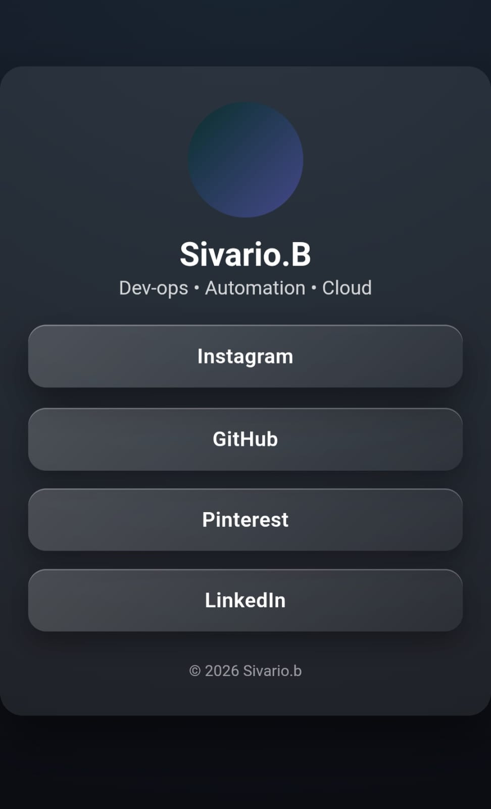

LINKLET
--
# A minimalist, high-performance landing page for your digital identity.

Linklet is a streamlined, single-page bio application built for marketing, social media, etc. It serves as a fast, elegant hub for your professional and social links—without the overhead, bloat, or maintenance burden of traditional site builders.

Designed with modern aesthetics and performance as first-class requirements, Linklet loads instantly, looks sharp on every device, and stays out of your way.

## Preview




Core Features
--

# Glassmorphism UI
A refined interface using backdrop blur, soft gradients, and subtle shadows for a premium, modern feel.

# Fully Responsive
Optimized for mobile, tablet, and desktop viewports by default.

# Zero Dependencies
Built entirely with vanilla HTML and CSS. No frameworks, no libraries, no runtime overhead.

# Performance-First
Ultra-lightweight codebase delivers near-instant load times and excellent SEO scores.

# Highly Customizable
Swap links, branding, and color schemes in seconds with a simple, readable structure.

# Technical Specifications

Linklet leverages modern CSS features to achieve its visual style and responsiveness:
--
```
Layout: CSS Flexbox

Styling: CSS3 Radial Gradients

Visual Effects: backdrop-filter (blur), layered box shadows

Typography: Native system font stack

Interactions: CSS transitions and active-state transforms
```

Quick Start
--
```
Clone the repository

git clone https://github.com/siv-the-programmer/linklet.git

Configure
Open index.html, locate the links section, and replace ENTER_LINK_HERE with your actual profile URLs.

Deploy
Linklet is a static site. Host it for free using GitHub Pages, Vercel, or Netlify. Push your changes and point your provider to the project root.
```

Author
---
# SIVARIO.B
DevOps • Automation • Cloud Infrastructure

License
--
This project is open-source and licensed under the MIT License.
